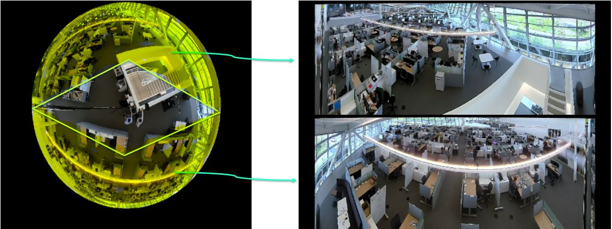

# Deepstream Dewarper App

This project demonstrate how to infer and track from a 360 videos by using the dewarper plugin. 
Dewarping the 360 videos helps to have better inference and tracking accuracy. 
It also includes a dynamic library libnvdsgst_dewarper.so which has more projection types than the libnvdsgst_dewarper.so file in the DeepStream 5.1 

## Prequisites:

Please follow instructions in the apps/sample_apps/deepstream-app/README on how
to install the prequisites for Deepstream SDK, the DeepStream SDK itself and the
apps.

- You must have the following development packages installed

   GStreamer-1.0
   GStreamer-1.0 Base Plugins
   GStreamer-1.0 gstrtspserver
   X11 client-side library

- To install these packages, execute the following command:

   sudo apt-get install libgstreamer-plugins-base1.0-dev libgstreamer1.0-dev \
   libgstrtspserver-1.0-dev libx11-dev

- Replace the libnvds_dewarper.so binary in /opt/nvidia/deepstream/deepstream-5.1/lib/ 
with the binary provided in this repo under the plugin_libraries
- Get the Tlt peoplenet model and label file. 
   - wget https://api.ngc.nvidia.com/v2/models/nvidia/tlt_peoplenet/versions/pruned_v2.1/files/resnet34_peoplenet_pruned.etlt
   - wget https://api.ngc.nvidia.com/v2/models/nvidia/tlt_peoplenet/versions/pruned_v2.1/files/labels.txt
   The models described in this card detect one or more physical objects from three categories within an image and return a box around each object, as well as a category label   for each object. Three categories of objects detected by these models are – persons, bags and faces.
   Please visit https://ngc.nvidia.com/catalog/models/nvidia:tlt_peoplenet for details. 

Compilation Steps:

  $ cd deepstream-dewarper-app/
  
  $ make
  
  $ ./deepstream-dewarper-app [1:file sink|2: fakesink|3:display sink] [1:without tracking| 2: with tracking] [<uri1> <camera_id1>] [<uri2> <camera_id2>] ... [<uriN> <camera_idN>]
e.g.
 
  - Single Stream
  
  $ ./deepstream-dewarper-app 3 1 file:///home/nvidia/sample_office.mp4 6 one_config_dewarper.txt

  // Single Stream for Perspective Projection type (needs config file change)
  $ ./deepstream-dewarper-app 3 1 file:///home/nvidia/yoga.mp4 0

  - Multi Stream
  
  $ ./deepstream-dewarper-app 3 1 file:///home/nvidia/sample_cam6.mp4 6 file:///home/nvidia/sample_cam6.mp4 6

The following description focus on the default use-case of detecting people in a grocery store but you can also use it to test other
types of applications that needs the dewarper functionality. 

(see Note below).
For more information on the general functionality and further examples see the
DeepStream Plugin Development Guide.

10 configuration files are provided:
   . under fisheye config files 8 config files are provided. Each config files here projects a fisheye camera to the other types of projections availble. 

To change the number of surfaces in use change the property "num-batch-buffers".
It should match the number of "surfaces" groups in the configuration file. So if
you want two surfaces per buffer you should have "num-batch-buffers"=2 and two
surfaces groups ([surface0] and [surface1]). Default value is 4.

Parameters:
uri - represents the input video stream

The dewarping parameters for the given camera can be configured in the config file provided 
to generate dewarp surfaces
input video stream.

Note:
gst-nvdewarper plugin uses "VRWorks 360 Video SDK".
For further details please refer to https://developer.nvidia.com/vrworks/vrworks-360video/download

For description of general dewarper parameters please visit the DeepStream
Plugin Development Guide.

-------------------------------

--------------
Common Fields
--------------

dewarpTopAngle - Top Field of View Angle, in degrees
dewarpBottomAngle - Bottom Field of View Angle, in degrees
dewarpPitch	- Viewing parameter Pitch, in degrees
dewarpYaw	- Viewing parameter Yaw, in degrees
dewarpRoll - Viewing parameter Roll, in degrees
dewarpFocalLength	- Focal Lenght of camera lens, in pixels per radian
dewarpWidth	- dewarped surface width
dewarpHeight - dewarped surface height

 
